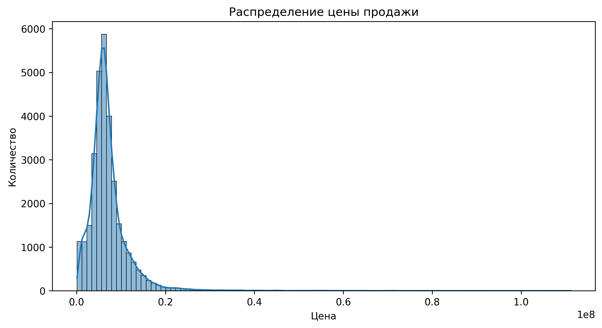
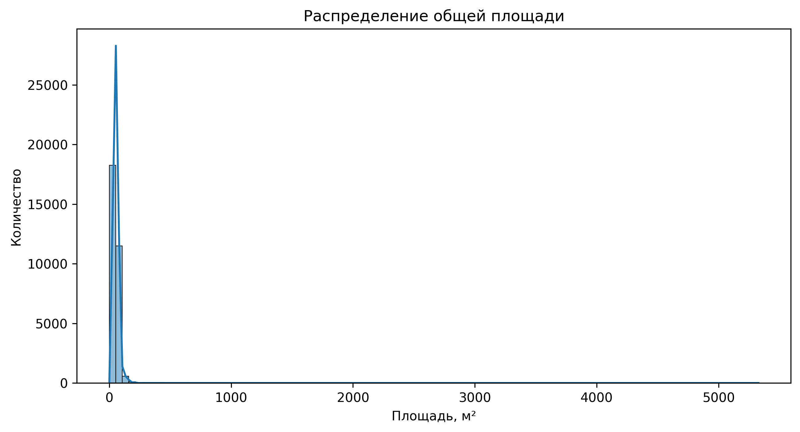
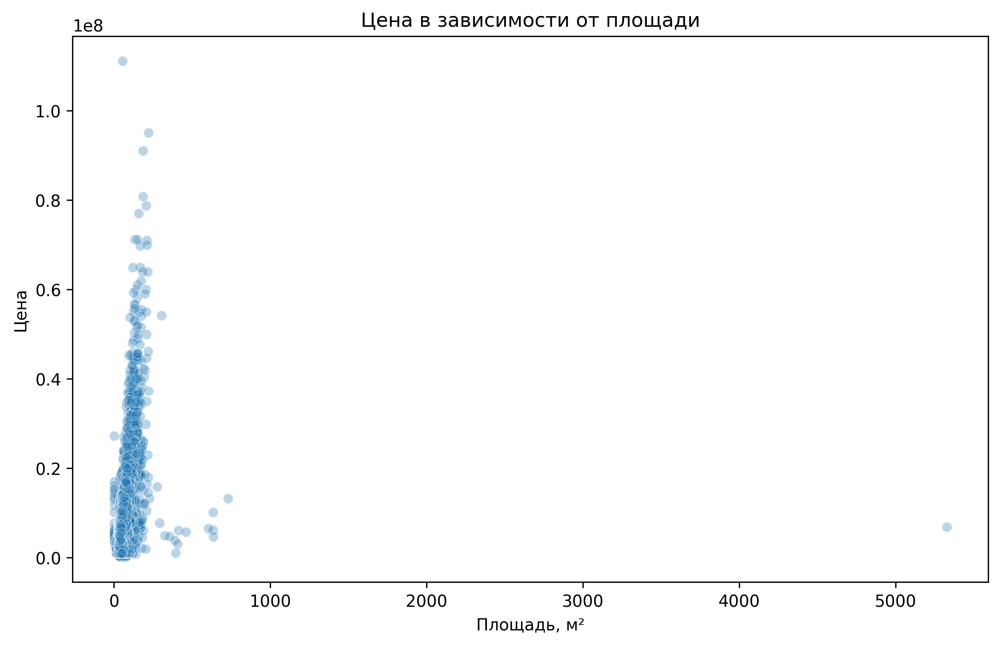
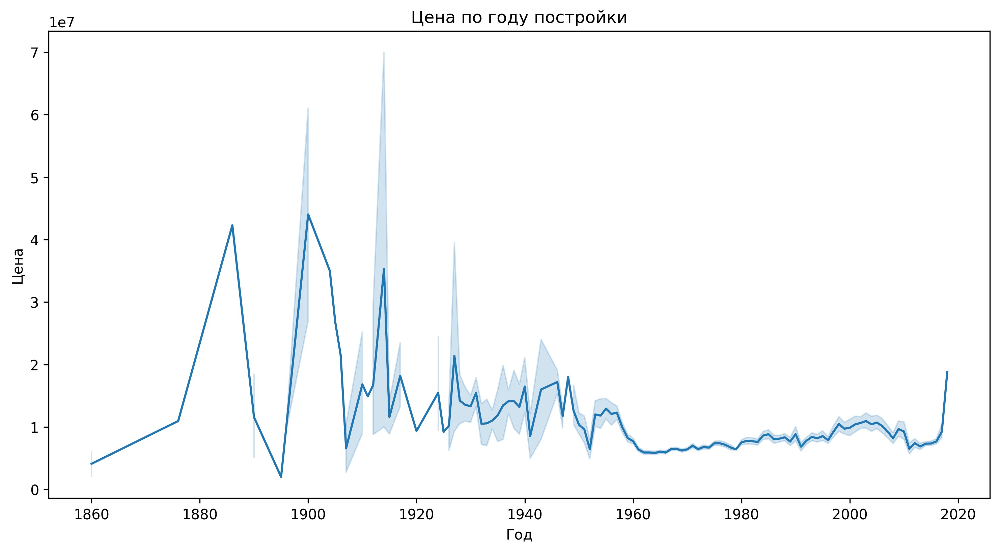
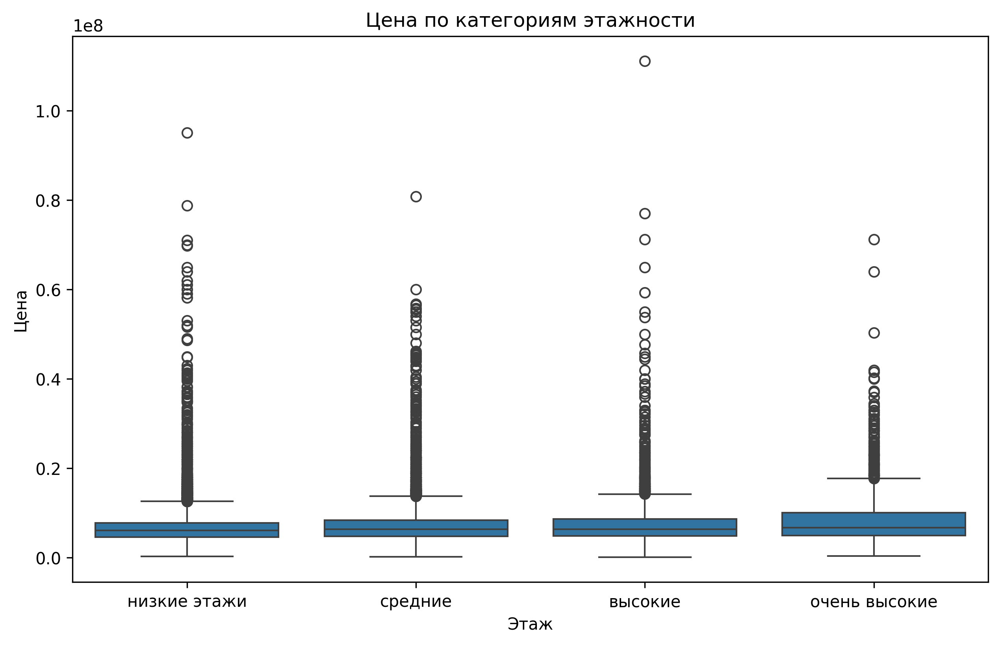
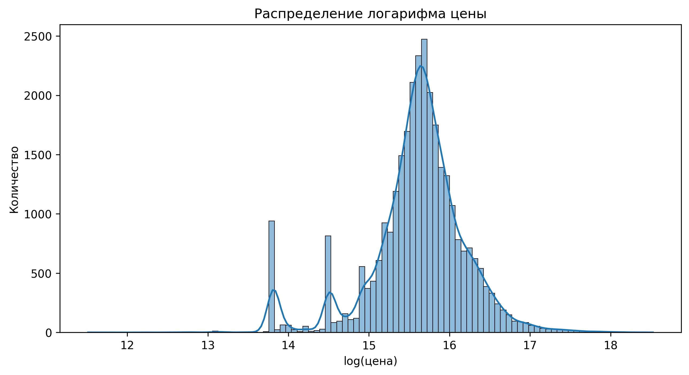
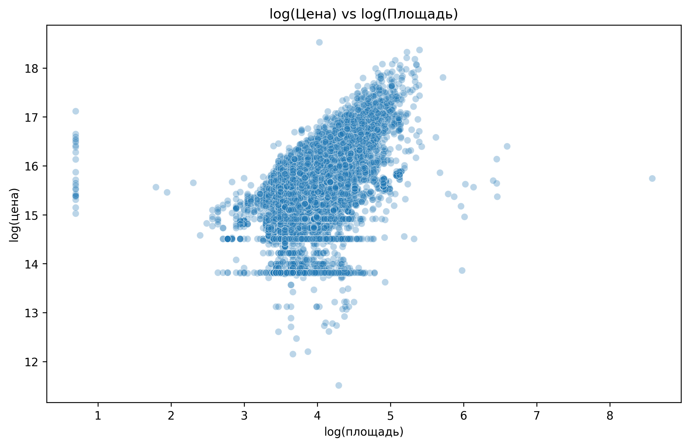

# Анализ и очистка данных о недвижимости

## 1. Введение

Этот отчёт посвящён исследованию и очистке реального датасета о ценах на недвижимость в Москве.

**Задачи проекта:**
- обнаружение и исправление аномалий
- очистка данных и заполнение пропусков
- инженерия признаков
- исследовательский анализ (EDA)
- сохранение ключевых визуализаций

Все графики, использованные в отчёте, находятся в директории:  
`results/plots/`

## 2. Описание данных

Изначальный датасет содержит 30 471 записей и более 280 признаков, включая:

- `price_doc` — цена продажи
- `full_sq` — общая площадь
- `life_sq` — жилая площадь
- `kitch_sq` — площадь кухни
- даты, этажи, метрики инфраструктуры и расстояний
- множество характеристик зданий и района

**В данных присутствуют:**
- пропуски
- логические ошибки (например `life_sq > full_sq`)
- ошибочные года постройки
- выбросы по площади и цене

## 3. Очистка данных

Очистка данных включала несколько этапов: поиск аномалий, исправление логических ошибок и заполнение пропусков.

### 3.1. Поиск аномалий

Были выявлены следующие проблемы:

- Отрицательная площадь (`full_sq < 0`)
- Жилая площадь больше общей (`life_sq > full_sq`)
- Площадь кухни больше общей (`kitch_sq > full_sq`)
- Нереалистичные годы постройки (до 1800 года или позже 2025)
- Этаж выше максимального количества этажей (`floor > max_floor`)
- Пропуски в ключевых переменных

Все аномалии были обработаны:

- некорректные строки удалены
- невозможные значения заменены на `None`
- оставшиеся пропуски заполнены медианами

### 3.2. Распределение цены (до очистки)

Это базовое распределение цен до трансформации.

### 3.3. Распределение общей площади

### 3.4. Цена vs площадь

График показывает зависимость между ценой и общей площадью:

### 3.5. Выбросы и пропуски

Отдельно была проведена обработка выбросов и пропусков.

### 3.6. Год постройки vs цена

### 3.7. Цена vs категория этажности

## 4. Пропуски и очистка данных

Исходный датасет содержал большое количество пропусков и логических ошибок.  
Для оценки масштаба проблем был построен график пропусков:

**Интерпретация:**

- Множество признаков инфраструктуры содержат более 30–40% пропусков
- Площади (`life_sq`, `kitch_sq`) имеют пропуски и аномалии
- У части объектов отсутствует год постройки
- Некоторые колонки имеют практически 100% пропусков и исключены из анализа

**Основные типы аномалий:**

- `life_sq > full_sq`
- `kitch_sq > full_sq`
- `full_sq < 1`
- `floor > max_floor`
- `build_year < 1800` или `build_year > 2025`

**Как исправляли:**

- Некорректные значения заменены на NaN
- Пропуски заполнены медианами по колонкам
- Явно невозможные строки удалены

## 5. Новые признаки и логарифмирование

Так как `price_doc` и `full_sq` сильно скошены, были созданы логарифмированные версии признаков:

- `log_price`
- `log_full_sq`

Это позволило нормализовать распределения.

### 5.1 Распределение логарифма цены

**Интерпретация:**  
Логарифм сглаживает длинный хвост и делает распределение ближе к нормальному → лучше видна структура данных.

### 5.2 Распределение логарифма площади

### 5.3 log(Цена) vs log(Площадь)

**Интерпретация:**  
После логарифмирования зависимость становится почти линейной — признак площади объясняет значительную часть вариации цены.

## 6. Корреляции и важность факторов

Для оценки влияния признаков на цену были рассчитаны корреляции между `price_doc` и всеми числовыми переменными.  
Затем из них выделены топ-факторы, наиболее сильно связанных с ценой.

### 6.1 Топ признаков, влияющих на цену

**Интерпретация:**

На цену сильнее всего влияют:

- Жилая площадь (`life_sq`)
- Общая площадь (`full_sq`)
- Количество комнат (`num_room`)
- Цена за метр (`price_per_m2`)
- Инфраструктура района
- Расстояние до центра
- Плотность объектов вокруг дома (спорт / магазины / ТЦ)

Эти признаки показывают максимальную корреляцию (по абсолютной величине) с ценой.

## 7. Дополнительные зависимости

### 7.1 Цена по году постройки

**Вывод:**

- Сильных трендов нет
- Старые дома показывают высокую дисперсию цены
- Новые дома более предсказуемы, но не обязательно дороже

### 7.2 Цена по группе этажей

**Вывод:**

- Квартиры на средних этажах имеют более стабильную стоимость
- Первый и последний этажи чаще имеют более высокую вариативность цены

## 8. Итоговый вывод

В ходе проекта был проведён полный цикл EDA и очистки данных:

### ✔ Что было сделано:

- исправлены явные ошибки в площадях, этажах и годах постройки
- удалены нереалистичные значения
- заполнены пропуски медианами
- проведено логарифмирование для нормализации
- изучены распределения ключевых признаков
- построены 10+ качественных визуализаций
- выявлены ключевые факторы, влияющие на цену

### ✔ Главные инсайты:

- Площадь — главный драйвер стоимости
- Количество комнат также существенно влияет
- Удалённость от центра и инфраструктура влияют значимо
- Квартиры с одинаковой площадью сильно различаются по цене в зависимости от района

- Логарифмирование сильно улучшает читаемость зависимостей

